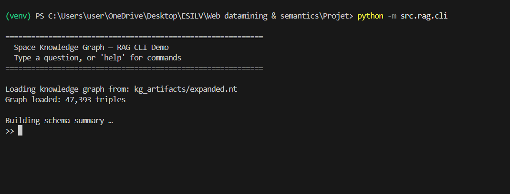
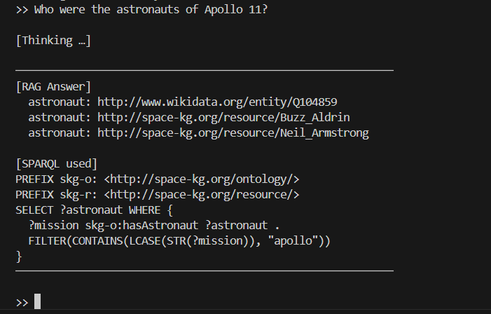

# Space Knowledge Graph

> **Web Datamining & Semantics · Final Project**
> Built as an end-to-end pipeline: web crawl → knowledge graph → reasoning → KGE → RAG

---

## Overview

This project builds a **knowledge graph about Space Exploration** from scratch, covering:

1. **Web crawling + Information Extraction**: 8 Wikipedia pages, spaCy NER, relation extraction
2. **KB Construction + Alignment**: RDF graph, OWL ontology, Wikidata entity/predicate alignment
3. **Reasoning + KGE**: SWRL rules (OWLReady2), TransE + ComplEx (PyKEEN), t-SNE analysis
4. **RAG over RDF/SPARQL**: NL→SPARQL via Ollama (gemma2:2b), self-repair loop, CLI demo

Domain: **Space Exploration** (NASA, astronauts, missions, telescopes, planets)

---

## Repository Structure

```
project-root/
├─ src/
│  ├─ crawl/         crawler.py, filter.py
│  ├─ ie/            ner.py, relation_extractor.py, run_ie.py
│  ├─ kg/            ontology_builder.py, rdf_builder.py, entity_alignment.py,
│  │                 predicate_alignment.py, kb_expansion.py, kb_stats.py
│  ├─ reason/        swrl_family.py, swrl_kb.py
│  ├─ kge/           prepare_splits.py, train_kge.py, evaluate_kge.py,
│  │                 sensitivity.py, visualize.py
│  └─ rag/           schema_summary.py, sparql_generator.py, self_repair.py,
│                    baseline.py, evaluate_rag.py, run_rag.py, cli.py
├─ data/
│  ├─ raw/           seed_urls.txt
│  ├─ processed/     crawler_output.jsonl, extracted_knowledge.csv,
│  │                 train.txt, valid.txt, test.txt
│  ├─ samples/       small committed example copies
│  └─ family.owl
├─ kg_artifacts/     ontology.ttl, initial_graph.ttl, alignment.ttl,
│                    expanded.nt, kb_stats.json, kge/
├─ reports/          final_report.md, kge_metrics.json, rag_evaluation.md, figures/
├─ README.md
└─ requirements.txt
```

---

## Hardware Requirements

| Component         | Minimum             | Recommended |
|-------------------|---------------------|-------------|
| RAM               | 8 GB                | 16 GB       |
| Disk space        | 5 GB                | 10 GB       |
| CPU               | 4 cores             | 8 cores     |
| GPU               | Not required        | Helps KGE   |
| Python            | 3.10+               |             |
| Java              | 11+ (for OWLReady2 reasoner) |  |

---

## Installation

### 1. Create a virtual environment

```bash
python -m venv .venv

# Windows
.venv\Scripts\activate

# macOS / Linux
source .venv/bin/activate
```

### 2. Install dependencies

```bash
pip install -r requirements.txt
```

### 3. Ollama setup (for RAG module)

Install Ollama from https://ollama.com, then:

```bash
ollama pull gemma2:2b
ollama serve          # start Ollama server (keep running in a separate terminal)
```

### Phase 1: Crawl

```bash
# Fetch 8 Wikipedia seed pages, extract main text, filter short pages
python -m src.crawl.crawler
# Output: data/processed/crawler_output.jsonl
```

### Phase 2: Information Extraction

```bash
# Run spaCy NER + dependency-based relation extraction
python -m src.ie.run_ie
# Output: data/processed/extracted_knowledge.csv
```

### Phase 3: Build the Knowledge Graph

```bash
# Build ontology
python -m src.kg.ontology_builder
# Output: kg_artifacts/ontology.ttl

# Build initial RDF graph from extracted_knowledge.csv
python -m src.kg.rdf_builder
# Output: kg_artifacts/initial_graph.ttl

# Align entities to Wikidata (requires internet)
python -m src.kg.entity_alignment
# Outputs: kg_artifacts/alignment.ttl, kg_artifacts/entity_mapping.csv

# Append predicate alignment
python -m src.kg.predicate_alignment
# Appends owl:equivalentProperty triples to alignment.ttl

# Expand KB via Wikidata SPARQL (requires internet, ~5–20 min)
python -m src.kg.kb_expansion
# Output: kg_artifacts/expanded.nt

# Compute KB statistics
python -m src.kg.kb_stats
# Output: kg_artifacts/kb_stats.json
```

### Phase 4: Reasoning

```bash
# SWRL on family.owl (requires Java + OWLReady2 reasoner)
python -m src.reason.swrl_family

# SWRL on project KB
python -m src.reason.swrl_kb
```

### Phase 5: KGE

```bash
# Prepare splits (80/10/10)
python -m src.kge.prepare_splits
# Outputs: data/processed/train.txt, valid.txt, test.txt

# Train TransE + ComplEx (default: 100 epochs)
python -m src.kge.train_kge
# Saves checkpoints to kg_artifacts/kge/

# Evaluate (MRR, Hits@1/3/10)
python -m src.kge.evaluate_kge
# Output: reports/kge_metrics.json

# KB size sensitivity (20k / 50k / full)
python -m src.kge.sensitivity

# t-SNE visualization + nearest neighbors
python -m src.kge.visualize
# Output: reports/figures/tsne.png
```

### Phase 6: RAG

> Requires Ollama running with `gemma2:2b` pulled. See Ollama Setup above.

```bash
# Run schema summary
python -m src.rag.schema_summary

# One-shot pipeline runner
python -m src.rag.run_rag --question "Who were the astronauts of Apollo 11?"

# Evaluate 5 questions (baseline vs RAG)
python -m src.rag.evaluate_rag
# Output: reports/rag_evaluation.md

# Interactive CLI demo
python -m src.rag.cli
```

---

## Full Pipeline (sequential, no flags needed)

```bash
python -m src.crawl.crawler
python -m src.ie.run_ie
python -m src.kg.ontology_builder
python -m src.kg.rdf_builder
python -m src.kg.entity_alignment
python -m src.kg.predicate_alignment
python -m src.kg.kb_expansion
python -m src.kg.kb_stats
python -m src.reason.swrl_family
python -m src.reason.swrl_kb
python -m src.kge.prepare_splits
python -m src.kge.train_kge
python -m src.kge.evaluate_kge
python -m src.kge.sensitivity
python -m src.kge.visualize
python -m src.rag.evaluate_rag
```

---

## Screenshots / Demo

Screenshots:



---
